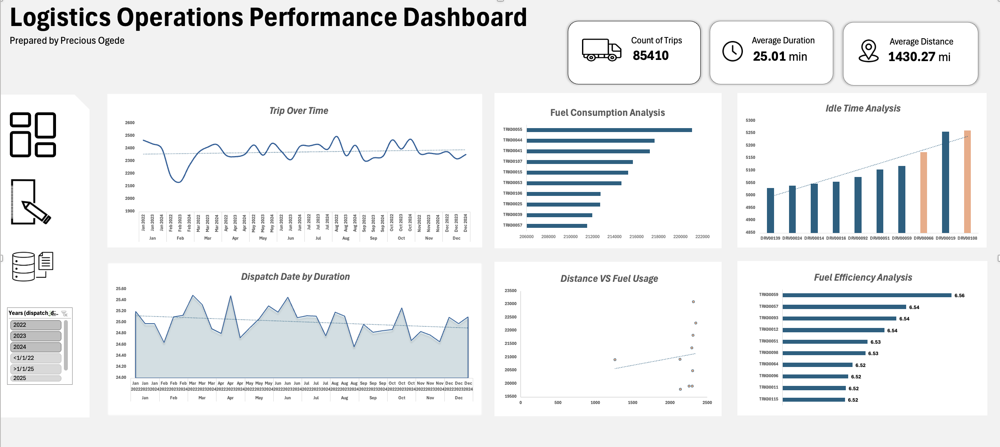

# How Do People Read Dashboards?

A dashboard interpretation and decision-making study exploring how users interact with an operational dashboard, interpret visual information, and translate insights into business actions.

---

## Project Overview

Dashboards are designed to transform data into actionable insights. However, a dashboard is only effective if users can correctly interpret the information it presents and make informed decisions from it.

This study evaluated how users interpreted a Logistics Operations Performance Dashboard. Rather than focusing only on visual appearance, the study explored what attracted users' attention, which sections they examined more closely, the operational concerns they identified, and the actions they would prioritize.

The study combined survey responses, exploratory data analysis, and qualitative analysis to evaluate dashboard communication and decision-making.

---

## Business Problem

Individuals invest significant time building dashboards, but dashboards are only valuable if users can quickly understand the information being presented.

Poorly communicated dashboards may lead to:

- Misinterpretation of business information.
- Poor decision-making.
- Increased cognitive effort.
- Important insights being overlooked.

This study therefore explored how users naturally interact with a dashboard and what design elements support better interpretation and decision-making.

---

## Objectives

The study aimed to:

- Evaluate how effectively the dashboard communicates its intended purpose.
- Identify the dashboard elements that attract users' attention first.
- Determine which dashboard sections users spend the most time interpreting.
- Explore the operational concerns users identify.
- Understand the actions users would prioritize after viewing the dashboard.
- Gather user feedback to improve future dashboard design.

---

## Dashboard

The Logistics Operations Performance Dashboard used in this study is shown below.

## Methodology

A structured questionnaire was created using Google Forms and distributed to participants.

Participants were asked to examine the Logistics Operations Performance Dashboard before responding to quantitative and qualitative questions.

The study involved **13 participants** from different professional backgrounds.

The analysis included:

- Survey response analysis.
- Data preparation and cleaning.
- Frequency analysis.
- Exploratory data analysis.
- Data visualization.
- Qualitative analysis of open-ended responses.

---

## Tools Used

- Microsoft Excel
- Google Forms
- Python
- Pandas
- NumPy
- Matplotlib
- Google Colab

---

## Key Findings

### 1. Participants correctly interpreted the dashboard's purpose

Most participants identified the dashboard as relating to logistics, transportation, or business performance.

This suggests that the dashboard communicated its intended purpose without requiring additional explanation.

### 2. Summary information attracted initial attention

Many participants first noticed high-level summary information, including KPI cards and other prominent visual elements.

This highlights the importance of visual hierarchy in dashboard design.

### 3. Detailed visualizations encouraged deeper analysis

Although summary information attracted initial attention, participants spent more time examining detailed charts and visualizations.

Participants described these charts as clear, organized, informative, and easy to interpret.

### 4. Participants identified different operational concerns

Participants identified several areas they considered important, including:

- Fuel consumption
- Idle time
- Dispatch duration
- Trip performance
- Overall operational efficiency

This shows that users can interpret the same dashboard from different operational perspectives.

### 5. Dashboard insights translated into potential actions

Participants generally selected actions that addressed the operational concerns they identified.

Examples included investigating fuel consumption, reducing idle time, improving dispatch efficiency, reviewing trip performance, and monitoring overall operational performance.

---

## Key Takeaways

The study highlighted that:

- Dashboard titles and summaries shape users' first impressions.
- Clear visualizations encourage deeper engagement.
- Effective dashboards should support decision-making rather than simply display data.
- Simplicity improves communication.
- User feedback can provide valuable insights for dashboard improvement.
- Dashboard evaluation should consider how users interpret information, not only how the dashboard looks.

---

## Limitations

The study had several limitations:

- The sample size was relatively small.
- Participants had different levels of analytical experience.
- Individual responses should not be generalized to all dashboard users.

---

## Project Files

- 📓 [View Python Analysis Notebook](How_Do_People_Read_Dashboards.ipynb)
- 📄 [View Full Dashboard Report](How Do People Read Dashboards.pdf)
---

## Conclusion

This study demonstrates that evaluating a dashboard goes beyond checking whether charts and KPIs are visually appealing.

An effective dashboard should communicate its purpose clearly, guide users toward meaningful insights, and support informed decision-making.

By combining survey data with exploratory data analysis and qualitative feedback, this study evaluated not only how the dashboard looked, but also how users interpreted and interacted with it.

---

## About Me

**Precious Ogede**

**Data Analyst** focused on transforming business data into actionable insights through analytics, business intelligence, and data visualization.

**Skills:** Python • Pandas • NumPy • SQL • Power BI • Tableau • Excel • Business Analytics • Data Visualization • Data Storytelling
